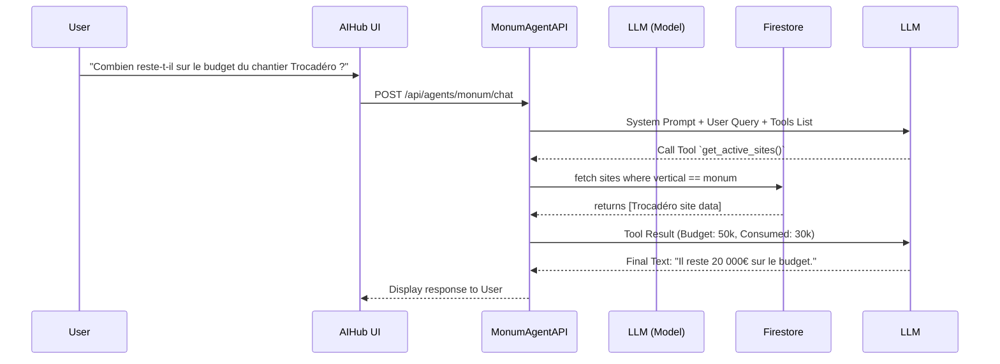

# Monum "Agent Travaux" Context

## Agent Name & Purpose
**Name**: Agent Travaux (Monum Site Agent)
**Purpose**: To assist property owners and site managers in tracking renovation projects ("Chantiers"), scheduling interventions ("Artisans"), and monitoring budgets. It acts as an autonomous assistant inside the Monum CRM.

## Available Tools/Functions
1. `get_active_sites(tenantId)`: Retrieves all currently active renovation projects with their budgets and timelines.
2. `analyze_project_feasibility(siteId, facts)`: Analyzes a project's details to calculate the **probability of success** (winning the quote, or staying within budget) and identifies major risks, similar to the existing AI probability scoring.
3. `schedule_intervention(siteId, supplierId, date)`: Books a new "Intervention" (Booking equivalent) on a specific site.
4. `log_site_expense(siteId, amount, description)`: Adds an expense to update the consumed budget of a site.
5. `generate_site_report(siteId)`: Generates a summary text of the current site status for the client.

## Triggers
- **Manual UI Trigger**: The user invokes the agent via the central `AIHub` (Chat or Voice) in the CRM when `vertical === 'monum'`.
- **System Trigger**: Can be invoked programmatically to parse incoming architectural PDFs and extract data (future).

## Data Flow Diagram

